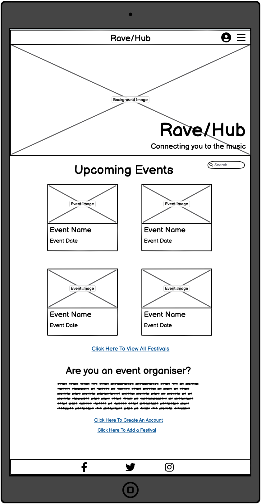

# [RAVE HUB](https://rave-hub-1d478d1cfdde.herokuapp.com)

source: [amiresponsive](https://ui.dev/amiresponsive?url=https://rave-hub-1d478d1cfdde.herokuapp.com)

Rave/Hub is a website made for educational purposes for my fourth portfolio project in software development that I am studying with the Code Institute. The website is aimed at users who are looking for upcoming festivals that they might like to attend. 

While designing this website I took into account the real world demands that users and event owners would have for a real events website. To adhere to these demands I have created a dynamic website what creates pages when a new event owner is added and when a new event is added by that owner for example. The website is fully responsive no matter what device it is viewed on. 

I have applied the technologies I have learnt so far and used HTML5, CSS3, Javascript, and Django to create the website. Other technologies used are listed in the technologies used section further down the page. 

## UX

I aimed to design a simple website to convey information to the users, and also to make the process of adding an event simple for the event owners. For these reasons I decided to use a hierarchical tree structure because I feel it is an easy to navigate structure that is commonly found and the user/event owner will be familiar with using throughout other websites. 

While designing the UX I decided to have a fixed navigation bar across all of the pages to allow for easy navigation throughout the site. This navigation bar also contains a dropdown feature for the user to be able to login and create an account. On the homepage there is a description of the site and the features it offers and it also displays a few of the next upcoming festivals in date order. Some other pages the site has are a list of all festivals, a page to add festivals, a contact page and signup and login pages. There is also a footer at the bottom of the page with links to the companies social media pages. 

### Colour Scheme

#### Main Colour Palette

I used [Coolors](https://coolors.co/ffffff-373f47-25292e-020c0e) to design my main colour palette. I decided to keep the colour palette very mono-tonal because I was using a colourful festival image in the background, so I wanted the to provide a good contrast to that so that the user could clearly read and differentiate between the content and the image. 

The colours I chose were a white for the font colour and then different shades of greys and black for the other colours. I changed the opacity of the boxes containing the content so that you could still slightly see the image in the background, but so that you could clearly read the text. The opacity of the hover links was also done in this way so that users would see an adjustment when the item was hovered over.

- `#FFFFF` White used for primary text.
- `#919396` Battleship Grey used for hover font colour
- `#FF0505` Red used for error pages
- `#373F47` Charcoal used for hover background colour
- `#25292E` - Gunmetal used for footer
- `#020C0E` - Rich Black used for nav bar and various other elements

Here is a link to my [colour palette](https://coolors.co/ffffff-373f47-25292e-020c0e).

#### Contrast Grid

I used [Contrast Grid Eight Shapes](https://contrast-grid.eightshapes.com/?version=1.1.0&background-colors=&foreground-colors=%23FFFFFF%20%0D%0A%23373F47%0D%0A%2325292E%0D%0A%23020C0E&es-color-form__tile-size=compact&es-color-form__show-contrast=aaa&es-color-form__show-contrast=aa&es-color-form__show-contrast=aa18&es-color-form__show-contrast=dnp) to check all of my colours for accessibility against each other.

### Typography

I used [Google Fonts](https://fonts.google.com/) for the fonts throughout the site. To find fonts that pair well together I used a combination of an article on [Canva](https://www.canva.com/learn/best-google-font-combinations/) and then also [Font Joy](https://fontjoy.com/) which helped me to choose my fonts. Font Joy which is a font generator where I entered my initial chosen fonts and it generates fonts that compliment it.

I chose to use Permanent Marker for my logo as I feel it portrays the edgy and playful emotions that come to mind when you think about a festival. 
For my headings and buttons I chose to use Montserrat as I feel It is a clear and easy to read font that complements the Permanent Marker font used in the logo. 
For all the other text I used the Open Sans font as it complements the other two and is a clear font to use for the content of the site. 

I used a backup font of Sans-Serif incase there was a problem loading the other fonts.

- [Permanent Marker](https://fonts.google.com/specimen/Permanent+Marker?query=perm) was used for all the logo text.

- [Montserrat](https://fonts.google.com/specimen/Montserrat) was used for the headers and buttons.

- [Open Sans](https://fonts.google.com/specimen/Open+Sans?query=open+sans) was used for all other secondary text.

- [Font Awesome](https://fontawesome.com/) icons were used throughout the site, such as the social media icons in the footer.

## User Stories

### Site Users

- As a site user I can easily view upcoming events so that I can plan which ones to attend.

- As a site user I can search for events so that I can only see events that interest me.

- As a site user I can see details of the events so that I can decide if I would like to attend.

- As a site user I can leave comments on the event page so that I can chat to other users with similar interests.

- As a site user I can send direct message to event owner so that I can get answers to any questions I have.

- As a site user I can find information about the site and services so that I can understand what the site offers.

- As a site user i can view other events by the event owner so that I can attend events by an owner I know puts on good events.

- As a site user I would like to contact the site owner so that they can answer any queries I have

### Event Owner

- As an event owner I can add an upcoming event so that I can encourage people to attend.

- As an event owner I can edit an upcoming event so that I can keep users updated.

- As an event owner I can delete an upcoming event that I have posted so that I can remove it from the website.

- As an event owner I can add details about an upcoming event so that I can provide users with relevant information.

- As an event owner I can create an account and sign in so that I am the only one who can modify the event I added.

- As an event owner I am able to change my password.

- As an event owner I can have a profile page with all my events displayed.

- As an event owner I am able to sign in with social media.

### Site Owner

- As a site owner I can approve events before they appear on the site.

- As a site owner I can log in to the admin panel so that I can manage events.

- As a site owner I can change the about text so that I can keep users updated with any relevant information.

- As a site owner I can provide users with a contact page so that they are able to contact us.

## Wireframes

To follow best practice, wireframes were developed for mobile, tablet, and desktop sizes.
I've used [Balsamiq](https://balsamiq.com/wireframes) to design my site wireframes.

### Mobile Wireframes

 Click here to see the Mobile Wireframes 

Home
  - 

Festival List
  - 

Festival Detail
  - 

Add Festival
  - 

Edit Festival
  - 

About
  - 

Contact Us
  - 

Festival Search
  - 

User Profile
  - 

Login
  - 

Logout
  - 

Change Password
  - 

Sign Up
  - 

### Tablet Wireframes

 Click here to see the Tablet Wireframes 

Home
  - 

Festival List
  - 

Festival Detail
  - 

Add Festival
  - 

Edit Festival
  - 

About
  - 

Contact Us
  - 

Festival Search
  - 

User Profile
  - 

Login
  - 

Logout
  - 

Change Password
  - 

Sign Up
  - 

### Desktop Wireframes

 Click here to see the Desktop Wireframes 

Home
  - 

Festival List
  - 

Festival Detail
  - 

Add Festival
  - 

Edit Festival
  - 

About
  - 

Contact Us
  - 

Festival Search
  - 

User Profile
  - 

Login
  - 

Logout
  - 

Change Password
  - 

Sign Up
  - 

