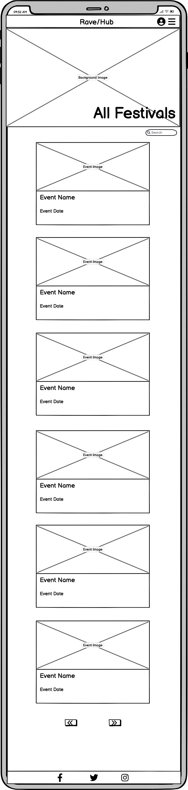
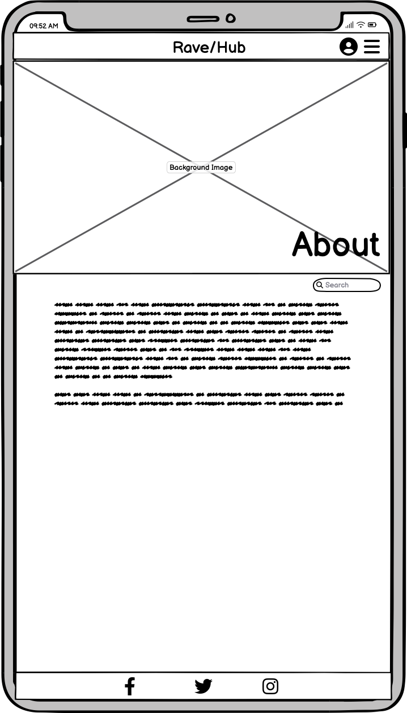
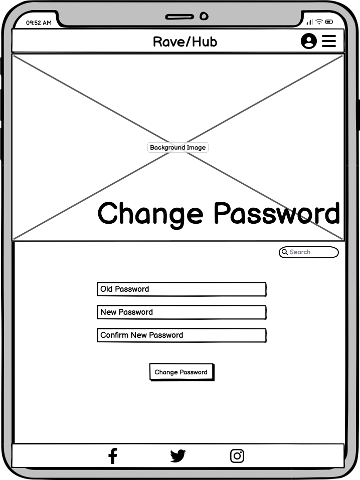
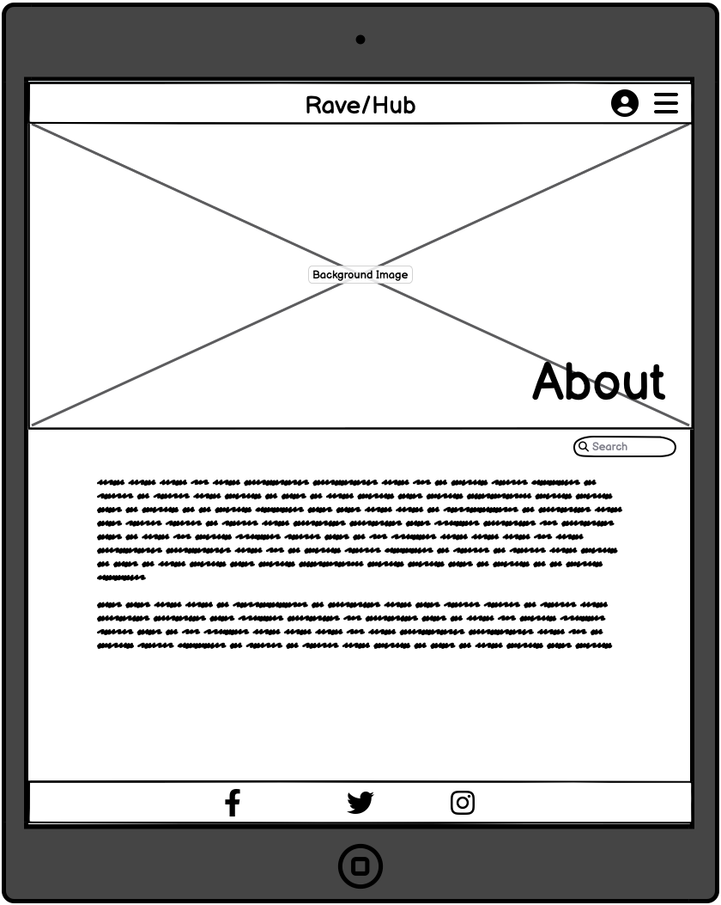
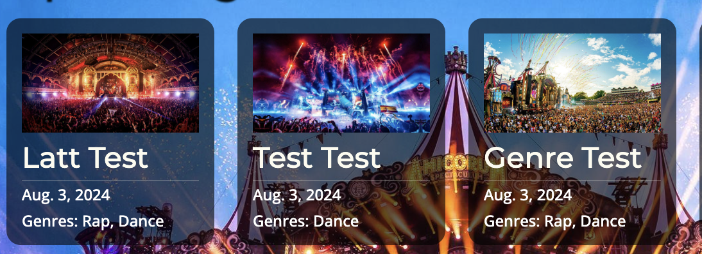

# [RAVE HUB](https://rave-hub-1d478d1cfdde.herokuapp.com)

[](https://github.com/lunartechfreek/rave-hub/commits/main)
[](https://github.com/lunartechfreek/rave-hub/commits/main)
[](https://github.com/lunartechfreek/rave-hub)


Rave/Hub is a website made for educational purposes for my fourth portfolio project in software development that I am studying with the Code Institute. The website is aimed at users who are looking for upcoming festivals that they might like to attend. 

While designing this website I took into account the real world demands that users and event owners would have for a real events website. To adhere to these demands I have created a dynamic website what creates pages when a new event owner is added and when a new event is added by that owner for example. The website is fully responsive no matter what device it is viewed on. 

I have applied the technologies I have learnt so far and used HTML5, CSS3, Javascript, and Django to create the website. Other technologies used are listed in the technologies used section further down the page. 

## UX

I aimed to design a simple website to convey information to the users, and also to make the process of adding an event simple for the event owners. For these reasons I decided to use a hierarchical tree structure because I feel it is an easy to navigate structure that is commonly found and the user/event owner will be familiar with using throughout other websites. 

While designing the UX I decided to have a fixed navigation bar across all of the pages to allow for easy navigation throughout the site. This navigation bar also contains a dropdown feature for the user to be able to login and create an account. On the homepage there is a description of the site and the features it offers and it also displays a few of the next upcoming festivals in date order. Some other pages the site has are a list of all festivals, a page to add festivals, a contact page and signup and login pages. There is also a footer at the bottom of the page with links to the companies social media pages. 


### Colour Scheme

#### Main Colour Palette

I used [Coolors](https://coolors.co/ffffff-373f47-25292e-020c0e) to design my main colour palette. I decided to keep the colour palette very mono-tonal because I was using a colourful festival image in the background, so I wanted the to provide a good contrast to that so that the user could clearly read and differentiate between the content and the image. 

The colours I chose were a white for the font colour and then different shades of greys and black for the other colours. I changed the opacity of the boxes containing the content so that you could still slightly see the image in the background, but so that you could clearly read the text. The opacity of the hover links was also done in this way so that users would see an adjustment when the item was hovered over.

- `#FFFFF` White used for primary text.
- `#919396` Battleship Grey used for hover font colour
- `#FF0505` Red used for error pages
- `#373F47` Charcoal used for hover background colour
- `#25292E` - Gunmetal used for footer
- `#020C0E` - Rich Black used for nav bar and various other elements

Here is a link to my [colour palette](https://coolors.co/ffffff-919396-ff0505-373f47-25292e-020c0e).


#### Contrast Grid

I used [Contrast Grid Eight Shapes](https://contrast-grid.eightshapes.com/) to check all of my colours for accessibility against each other.


### Typography

I used [Google Fonts](https://fonts.google.com/) for the fonts throughout the site. To find fonts that pair well together I used a combination of an article on [Canva](https://www.canva.com/learn/best-google-font-combinations/) and then also [Font Joy](https://fontjoy.com/) which helped me to choose my fonts. Font Joy which is a font generator where I entered my initial chosen fonts and it generates fonts that compliment it.

I chose to use Permanent Marker for my logo as I feel it portrays the edgy and playful emotions that come to mind when you think about a festival. 
For my headings and buttons I chose to use Montserrat as I feel It is a clear and easy to read font that complements the Permanent Marker font used in the logo. 
For all the other text I used the Open Sans font as it complements the other two and is a clear font to use for the content of the site. 

I used a backup font of Sans-Serif incase there was a problem loading the other fonts.

- [Permanent Marker](https://fonts.google.com/specimen/Permanent+Marker?query=perm) was used for all the logo text.

- [Montserrat](https://fonts.google.com/specimen/Montserrat) was used for the headers and buttons.

- [Open Sans](https://fonts.google.com/specimen/Open+Sans?query=open+sans) was used for all other secondary text.

- [Font Awesome](https://fontawesome.com/) icons were used throughout the site, such as the social media icons in the footer.

## User Stories

### Site Users

- As a site user I can easily view upcoming events so that I can plan which ones to attend.

- As a site user I can search for events so that I can only see events that interest me.

- As a site user I can see details of the events so that I can decide if I would like to attend.

- As a site user I can leave comments on the event page so that I can chat to other users with similar interests.

- As a site user I can send direct message to event owner so that I can get answers to any questions I have.

- As a site user I can find information about the site and services so that I can understand what the site offers.

- As a site user i can view other events by the event owner so that I can attend events by an owner I know puts on good events.

- As a site user I would like to contact the site owner so that they can answer any queries I have

### Event Owner

- As an event owner I can add an upcoming event so that I can encourage people to attend.

- As an event owner I can edit an upcoming event so that I can keep users updated.

- As an event owner I can delete an upcoming event that I have posted so that I can remove it from the website.

- As an event owner I can add details about an upcoming event so that I can provide users with relevant information.

- As an event owner I can create an account and sign in so that I am the only one who can modify the event I added.

- As an event owner I am able to change my password.

- As an event owner I can have a profile page with all my events displayed.

- As an event owner I am able to sign in with social media.

### Site Owner

- As a site owner I can approve events before they appear on the site.

- As a site owner I can log in to the admin panel so that I can manage events.

- As a site owner I can change the about text so that I can keep users updated with any relevant information.

- As a site owner I can provide users with a contact page so that they are able to contact us.


## Wireframes

To follow best practice, wireframes were developed for mobile, tablet, and desktop sizes.
I've used [Balsamiq](https://balsamiq.com/wireframes) to design my site wireframes.

### Mobile Wireframes

<details>
<summary> Click here to see the Mobile Wireframes </summary>

Home
  - 

Festival List
  - 

Festival Detail
  - 

Add Festival
  - 

Edit Festival
  - 

About
  - 

Contact Us
  - 

Festival Search
  - 

User Profile
  - 

Login
  - 

Logout
  - 

Change Password
  - 

Sign Up
  - 


</details>

### Tablet Wireframes

<details>
<summary> Click here to see the Tablet Wireframes </summary>

Home
  - 

Festival List
  - 

Festival Detail
  - 

Add Festival
  - 

Edit Festival
  - 

About
  - 

Contact Us
  - 

Festival Search
  - 

User Profile
  - 

Login
  - 

Logout
  - 

Change Password
  - 

Sign Up
  - 

</details>

### Desktop Wireframes

<details>
<summary> Click here to see the Desktop Wireframes </summary>

Home
  - 

Festival List
  - 

Festival Detail
  - 

Add Festival
  - 

Edit Festival
  - 

About
  - 

Contact Us
  - 

Festival Search
  - 

User Profile
  - 

Login
  - 

Logout
  - 

Change Password
  - 

Sign Up
  - 

</details>

## Features

### Existing Features

- Logo

    -  The logo is fixed on the navigation bar on the far left so the user always knows which website that they are on and that they aren’t being redirected to any other sites when browsing. The logo is also a link back to the home page when clicked for easy navigation for users. 


- Change Password

    -  I chose to add a music note to the favicon to go with the theme of festivals.


- Navigation Bar

    -  The navigation bar is fixed at the top of the page and consists of the logo, page links, and the account menu. The links have hover and active classes applied to them and light up when hovered over or the user is on that page. This is so the user always knows what page they are on. 

    

    - The navigation bar is fully responsive and collapses into a hamburger menu on screens with a width below 768px so as to not be cluttered with links at the top on smaller screen sizes.

    

- Dropdown Menu

    -  On screens with a width below 768px when the hamburger menu is clicked the links are displayed neatly in a drop down menu instead. 


- Account Menu

    -  The account menu is fixed on to the navigation bar at the top of the screen and features links related to the users account such as their profile, login, logout, sign up and change password. The links displayed are dependant on whether the user is logged in or not.

    Logged In

    

    Logged Out

    

- Dynamic Page Title

    -  The page title is displayed at the top of every page but is pushed down the page so as to show a lot of the background image when the page is first loaded so it almost acts like a hero image as well as a background image. With the background constantly changing colours behind it I used a text shadow to make the letters pop a bit and also for better accessibility.


- Search Bar

    -  There is a search bar at the top of the page so the user can search for festivals by searching either the title, genre, or artists. I added this to every page to allow for easy navigation.


- Dynamic Background

    -  The background is changed for every page through use of classes and template tags. On the festival detail page it is dynamically changed to whatever image the user uploaded for the festival. If no image was uploaded then it would be filled by a placeholder image instead. The background is static and only the content scrolls. 


- Footer

    -  The footer sits at the bottom of every page and contains links to the companies social media accounts. When these are clicked they are opened in a new window to avoid taking the user away from the website. 


- Carousel

    -  The carousel was added using [Slick Slider](https://kenwheeler.github.io/slick/). It displays 6 festivals using pagination in order of date. On larger devices there are navigation arrows and also dots representing the page at the bottom. Both the arrows and dots have a hover class on them to change colour when hovered over. The dots also have an active class on them to display what page the user is on. The cards themselves are fully clickable as a link to the festival detail page and when hovered over the opacity gets darker to show this. 


- Welcome

    -  There is a welcome section at the bottom of the home page with links to help new event owners add a website. The links shown depend on the users login status.

    Logged In

    

    Logged Out

    

- Add Festival Form

    -  The add festival form contains fields for name. Artists, website, image, date, time, location and a map picker. The website URL is cleaned up in the backend to add ‘https://' dynamically. 


- Artist Scroll Box

    -  The artist field in the add festival form is displayed as a scrollable box so that if there are a lot of artists it does not clutter the page. 


- Calender Widget

    -  I used a widget to display the calendar so it is more visually pleasing to the user. Users can not add a festival for a past date due to the handling of this in the back end so past dates are not clickable and are greyed out in the widget. 


- Time Slot Widget

    -  I used a widget to display the time slots in a scrollable dropdown menu.


- Map Location Picker

    -  I used [Leaflet](https://leafletjs.com/index.html) to add a field for a map picker tool. I did this so that event owners can physically show users exactly where the festival is located. 


- Festival Details

    -  The festival details are displayed on a dynamically created page using the id. It displays all of the information entered by the event owner when adding an event. It also has a link to the event owners profile page where they can view other events listed by them. 


- Artist Dropdown

    -  On the festival detail page I decided to display the artists in a collapsible box so that if there are a lot of artists listed it will not clutter the page. 


- Map Marker

    -  On the festival detail page the marker that shows the location on the map dynamically displays the name of the festival.


- Edit/Delete Buttons

    -  On the festival detail page there are edit and delete buttons that are only displayed to the user that added the event. 


- Pre Populate Edit Page

    -  On the edit festival page it is pre populated with the data that is already in the database from when the event was added. 


- Delete Modal

    -  When the event owner chooses to delete an event, a modal appears asking them if to confirm. This was done to make sure the user defiantly wants to delete it and it wasn’t just clicked by mistake.


- Event Cards

    -  On the all festivals and the festival search page I displayed the events on cards so as to stand out from the colourful background. The cards themselves are fully clickable as a link to the festival detail page and when hovered over the opacity gets darker to show this. 



- Pagination Buttons

    -  When there are over 8 events on the all festivals and festival search page pagination is used to dynamically create pages for the other events. This was done so that not too many festivals were shown at once and helps create a more user friendly website. When the other pages are created the pagination buttons appear at the bottom of the screen. 


- Approved/Pending Events

    -  If the event owner goes on their profile page they will be able to see their events that they have uploaded split into approved and pending sections. This is so that they can still edit the events that haven’t been approved yet before waiting for approval incase they needed to change it. 

    
    

- Placeholder Image

    -  If a user does not upload a festival image a placeholder is used instead. 


- Search Results

    -  When a user makes a search query using the search bar the results are displayed on a new page with a dynamic heading returning the string of the query searched. 


- About

    -  The about section is fully editable by the site owner so that they can update the about text whenever they like.


- Updated On

    -  On the about page it displays to the user when the about text was last edited so that can see how up to date it is. 


- Contact Form

    -  The contact form is a way for a user to contact the site owner and ask any questions they have. This was done using a contact form. The site owner will then be able to view the users query in the admin panel. 


- User Profile

    -  Each user has a profile page that is created dynamically. This is filled with all the events that they so that the user can attend other events hosted by that event owner. 


- Messages

    -  When a user performs certain actions such as logs in or out, or adds an event for example, a message is displayed at the top to confirm their action was successful. If it wasn’t an error message is displayed instead. 


- Sign Up

    -  There is a sign up page for users to create an account. 


- Login

    -  There is a login page for users to login. 


- Logout

    -  There is a logout page confirming that the user defiantly wants to logout.


- Change Password

    -  There is a change password page for users that want to change their password.


- 404 Error Page

    -  There is a 404 error page incase users enter a wrong URL. There are buttons on this page to easily navigate them back to the site. 


- 500 Error Page

    -  There is a 404 error page and there are buttons on this page to easily navigate them back to the site. 


### Future Features

In the future there are a few other features that I would like to add to the website. These are:

- Log In With Social Media
    - For the users to be able to log in with their social media accounts so as to make the login process even more simple and quick to do. 
- Comment Section 
    - For the users to be able to leave comments on the festival detail page. This would help users engage with other users and also to speak directly to the event owner who could also comment back to them.
- Add Other Artists
    - For the event owner to be able to add artists to the database that are not currently on there.
- Lighthouse Accessibility
    - As a future devolpment I would change the way that the festival detail background image is displayed so as to avoid it causing an error in the lighthouse report. 

## Tools & Technologies Used

- [](https://tim.2bn.dev/markdown-builder) used to generate README and TESTING templates.
- [](https://git-scm.com) used for version control. (`git add`, `git commit`, `git push`)
- [](https://github.com) used for secure online code storage.
- [](https://gitpod.io) used as a cloud-based IDE for development.
- [](https://en.wikipedia.org/wiki/HTML) used for the main site content.
- [](https://en.wikipedia.org/wiki/CSS) used for the main site design and layout.
- [](https://www.javascript.com) used for user interaction on the site.
- [](https://jquery.com) used for user interaction on the site.
- [](https://www.python.org) used as the back-end programming language.
- [](https://www.heroku.com) used for hosting the deployed back-end site.
- [](https://getbootstrap.com) used as the front-end CSS framework for modern responsiveness and pre-built components.
- [](https://www.djangoproject.com) used as the Python framework for the site.
- [](https://dbs.ci-dbs.net) used as the Postgres database from Code Institute.
- [](https://cloudinary.com) used for online static file storage.
- [](https://whitenoise.readthedocs.io) used for serving static files with Heroku.
- [](https://balsamiq.com/wireframes) used for creating wireframes.
- [](https://leafletjs.com) used as a free open-source interactive map on my site.
- [](https://fontawesome.com) used for the icons.
- [](https://chat.openai.com) used to help debug, troubleshoot, and explain things.
- [](https://www.lucidchart.com/pages/ER-diagram-symbols-and-meaning) used to create ERD diagram.
- [](https://shields.io/badges) Used to generate badges.
- [](https://kenwheeler.github.io/slick/) used to create carousel.
- [](https://gauger.io/fonticon/) Used to generate favicon.
- [](https://coolors.co/ffffff-919396-ff0505-373f47-25292e-020c0e) Used to generate my colour palette.
- [](https://contrast-grid.eightshapes.com/) Used to generate contrast grid.
- [](https://fonts.google.com/) Used for fonts.
- [Am I Responsive?](https://ui.dev/amiresponsive) used to generate preview imagery of the responsive design used throughout the website.
- [BrowserStack](https://www.browserstack.com/) used to emmulate different devices and browsers to test my website on.
- [Chrome DevTools](https://developer.chrome.com/docs/devtools/) used to check my responsive design and to run my lighthouse report. 


## Database Design

### Event

```python
class Festival(models.Model):
    """ 
    A model for each festival of events. 
    Related to :model:`auth.Genre`, :model:`auth.User`, 
    :model:`auth.Artist` and :model:`auth.CloudinaryField`
    """
    name = models.CharField(max_length=100, null=False, blank=False)
    event_manager = models.ForeignKey(User, on_delete=models.CASCADE)
    artists = models.ManyToManyField(Artist, related_name="festivals")
    website = models.URLField(max_length=256, blank=True, null=True)
    featured_image = CloudinaryField('image', default='placeholder')
    date = models.DateField(null=False, blank=False)
    time = models.CharField(choices=TIME_SLOTS, null=False, blank=False)
    location_name = models.CharField(max_length=255, null=False, blank=False)
    latitude = models.DecimalField(
        max_digits=9, decimal_places=6, null=False, blank=False)
    longitude = models.DecimalField(
        max_digits=9, decimal_places=6, null=False, blank=False)
    approved = models.BooleanField(default=False)


class Genre(models.Model):
    """ 
    A model for artist genres (managed by site owner). 
    """
    name = models.CharField(max_length=75, null=False, blank=False)


class Artist(models.Model):
    """ 
    A model for each artist (managed by site owner). 
    Related to :model:`auth.Genre`

    """
    name = models.CharField(max_length=100, null=False, blank=False)
    genre = models.ForeignKey(Genre, on_delete=models.CASCADE)
```
### Information

```python
class About(models.Model):
    """
    A model for the about information.
    """
    content = models.TextField()
    updated_on = models.DateTimeField(auto_now=True)


class ContactUs(models.Model):
    """
    A model for the contact us form.
    """
    name = models.CharField(max_length=200)
    email = models.EmailField()
    message = models.TextField()
    read = models.BooleanField(default=False)
```

### My ERD diagram


I have used `pygraphviz` and `django-extensions` to auto-generate an ERD.

The steps taken were as follows:
- In the terminal: `sudo apt update`
- then: `sudo apt-get install python3-dev graphviz libgraphviz-dev pkg-config`
- then type `Y` to proceed
- then: `pip3 install django-extensions pygraphviz`
- in my `settings.py` file, I added the following to my `INSTALLED_APPS`:
```python
INSTALLED_APPS = [
    ...
    'django_extensions',
    ...
]
```
- back in the terminal: `python3 manage.py graph_models -a -o erd.png`
- dragged the new `erd.png` file into my `documentation/` folder
- removed `'django_extensions',` from my `INSTALLED_APPS`
- finally, in the terminal: `pip3 uninstall django-extensions pygraphviz -y`


source: [medium.com](https://medium.com/@yathomasi1/1-using-django-extensions-to-visualize-the-database-diagram-in-django-application-c5fa7e710e16)


## Agile Development Process

### GitHub Projects

[GitHub Projects](https://github.com/lunartechfreek/rave-hub/projects) served as an Agile tool for this project.
It isn't a specialized tool, but with the right tags and project creation/issue assignments, it can be made to work.

Through it, user stories, issues, and milestone tasks were planned, then tracked using the basic Kanban board.


### GitHub Issues

[GitHub Issues](https://github.com/lunartechfreek/rave-hub/issues) served as an another Agile tool.
There, I used my own **User Story Template** to manage user stories.

It also helped with milestone iterations.

- [Open Issues](https://github.com/lunartechfreek/rave-hub/issues) [](https://github.com/lunartechfreek/rave-hub/issues)

    

- [Closed Issues](https://github.com/lunartechfreek/rave-hub/issues?q=is%3Aissue+is%3Aclosed) [](https://github.com/lunartechfreek/rave-hub/issues?q=is%3Aissue+is%3Aclosed)

    
    

### MoSCoW Prioritization

I've decomposed my Epics into stories prior to prioritizing and implementing them.
Using this approach, I was able to apply the MoSCow prioritization and labels to my user stories within the Issues tab.

- **Must Have**: guaranteed to be delivered (*max 60% of stories*)
- **Should Have**: adds significant value, but not vital (*the rest ~20% of stories*)
- **Could Have**: has small impact if left out (*20% of stories*)
- **Won't Have**: not a priority for this iteration

## Testing

> For all testing, please refer to the [TESTING.md](TESTING.md) file.

## Deployment

The live deployed application can be found deployed on [Heroku](https://rave-hub-1d478d1cfdde.herokuapp.com).

### PostgreSQL Database

This project uses a [Code Institute PostgreSQL Database](https://dbs.ci-dbs.net).

To obtain my own Postgres Database from Code Institute, I followed these steps:

- Signed-in to the CI LMS using my email address.
- An email was sent to me with my new Postgres Database.

> - PostgreSQL databases by Code Institute are only available to CI Students.
> - You must acquire your own PostgreSQL database through some other method
> if you plan to clone/fork this repository.
> - Code Institute students are allowed a maximum of 8 databases.
> - Databases are subject to deletion after 18 months.

### Cloudinary API

This project uses the [Cloudinary API](https://cloudinary.com) to store media assets online, due to the fact that Heroku doesn't persist this type of data.

To obtain your own Cloudinary API key, create an account and log in.

- For *Primary interest*, you can choose *Programmable Media for image and video API*.
- Optional: *edit your assigned cloud name to something more memorable*.
- On your Cloudinary Dashboard, you can copy your **API Environment Variable**.
- Be sure to remove the `CLOUDINARY_URL=` as part of the API **value**; this is the **key**.

### Heroku Deployment

This project uses [Heroku](https://www.heroku.com), a platform as a service (PaaS) that enables developers to build, run, and operate applications entirely in the cloud.

Deployment steps are as follows, after account setup:

- Select **New** in the top-right corner of your Heroku Dashboard, and select **Create new app** from the dropdown menu.
- Your app name must be unique, and then choose a region closest to you (EU or USA), and finally, select **Create App**.
- From the new app **Settings**, click **Reveal Config Vars**, and set your environment variables.

> This is a sample only; you would replace the values with your own if cloning/forking my repository.

| Key | Value |
| --- | --- |
| `CLOUDINARY_URL` | user's own value |
| `DATABASE_URL` | user's own value |
| `DISABLE_COLLECTSTATIC` | 1 (*this is temporary, and can be removed for the final deployment*) |
| `SECRET_KEY` | user's own value |

Heroku needs three additional files in order to deploy properly.

- requirements.txt
- Procfile
- runtime.txt

You can install this project's **requirements** (where applicable) using:

- `pip3 install -r requirements.txt`

If you have your own packages that have been installed, then the requirements file needs updated using:

- `pip3 freeze --local > requirements.txt`

The **Procfile** can be created with the following command:

- `echo web: gunicorn app_name.wsgi > Procfile`
- *replace **app_name** with the name of your primary Django app name; the folder where settings.py is located*

The **runtime.txt** file needs to know which Python version you're using:
1. type: `python3 --version` in the terminal.
2. in the **runtime.txt** file, add your Python version:
	- `python-3.9.19`

For Heroku deployment, follow these steps to connect your own GitHub repository to the newly created app:

Either:

- Select **Automatic Deployment** from the Heroku app.

Or:

- In the Terminal/CLI, connect to Heroku using this command: `heroku login -i`
- Set the remote for Heroku: `heroku git:remote -a app_name` (replace *app_name* with your app name)
- After performing the standard Git `add`, `commit`, and `push` to GitHub, you can now type:
	- `git push heroku main`

The project should now be connected and deployed to Heroku!

### Local Deployment

This project can be cloned or forked in order to make a local copy on your own system.

For either method, you will need to install any applicable packages found within the *requirements.txt* file.

- `pip3 install -r requirements.txt`.

You will need to create a new file called `env.py` at the root-level,
and include the same environment variables listed above from the Heroku deployment steps.

> This is a sample only; you would replace the values with your own if cloning/forking my repository.

Sample `env.py` file:

```python
import os

os.environ.setdefault("CLOUDINARY_URL", "user's own value")
os.environ.setdefault("DATABASE_URL", "user's own value")
os.environ.setdefault("SECRET_KEY", "user's own value")

# local environment only (do not include these in production/deployment!)
os.environ.setdefault("DEBUG", "True")
```

Once the project is cloned or forked, in order to run it locally, you'll need to follow these steps:

- Start the Django app: `python3 manage.py runserver`
- Stop the app once it's loaded: `CTRL+C` or `⌘+C` (Mac)
- Make any necessary migrations: `python3 manage.py makemigrations`
- Migrate the data to the database: `python3 manage.py migrate`
- Create a superuser: `python3 manage.py createsuperuser`
- Load fixtures (if applicable): `python3 manage.py loaddata file-name.json` (repeat for each file)
- Everything should be ready now, so run the Django app again: `python3 manage.py runserver`

#### Cloning

You can clone the repository by following these steps:

1. Go to the [GitHub repository](https://github.com/lunartechfreek/rave-hub) 
2. Locate the Code button above the list of files and click it 
3. Select if you prefer to clone using HTTPS, SSH, or GitHub CLI and click the copy button to copy the URL to your clipboard
4. Open Git Bash or Terminal
5. Change the current working directory to the one where you want the cloned directory
6. In your IDE Terminal, type the following command to clone my repository:
	- `git clone https://github.com/lunartechfreek/rave-hub.git`
7. Press Enter to create your local clone.

Alternatively, if using Gitpod, you can click below to create your own workspace using this repository.

[](https://gitpod.io/#https://github.com/lunartechfreek/rave-hub)

Please note that in order to directly open the project in Gitpod, you need to have the browser extension installed.
A tutorial on how to do that can be found [here](https://www.gitpod.io/docs/configure/user-settings/browser-extension).

#### Forking

By forking the GitHub Repository, we make a copy of the original repository on our GitHub account to view and/or make changes without affecting the original owner's repository.
You can fork this repository by using the following steps:

1. Log in to GitHub and locate the [GitHub Repository](https://github.com/lunartechfreek/rave-hub)
2. At the top of the Repository (not top of page) just above the "Settings" Button on the menu, locate the "Fork" Button.
3. Once clicked, you should now have a copy of the original repository in your own GitHub account!

### Local VS Deployment

There were no major differences that I found between the Gitpod site and the live deployed Heroku site.

## Credits

### Content

| Source | Location | Notes |
| --- | --- | --- |
| [Markdown Builder](https://tim.2bn.dev/markdown-builder) | README and TESTING | tool to help generate the Markdown files |
| [Chat GPT](https://openai.com/index/chatgpt/) | entire site | Used throughout the site for help and debugging with various things such as: |
| | event/forms.py | Datepicker widget, clean_website method |
| | event/views.py | @login_required, how to save ManyToManyField, the use of context to render the page, the use of query for the search bar, pagination |
| | festival_list.html | Displaying pagination page number |
| | add_festival.html, edit_festival.html | How to stop users from entering date in the past |
| | models.py | get_genres method, the use of verbose_name_plurus to change how the fields were displayed in admin panel |
| [W3Schools](https://www.w3schools.com/django/ref_lookups_gte.php) | event/views.py | Displaying the events |
| [Django Documentation](https://docs.djangoproject.com/en/4.2/ref/forms/widgets/) | event/forms.py  | Artist checkboxes widget |
| [Bootstrap Documentation](https://getbootstrap.com/docs/4.0/components/modal/) | edit_festival.html | Delete festival modal |
| [Leaflet](https://leafletjs.com/examples.html) | add_festival.html, edit_festival.html, festival_detail.html | Leaflet map tutorial |
| [YouTube](https://www.youtube.com/watch?v=_Z_1ELEnrlM) | index.html | Slick Slider tutorial |
| [Slick Slider](https://kenwheeler.github.io/slick/) | index.html | Guide on how to use Slick Slider |
| [strftime](https://strftime.org) | CRUD functionality | Tool to format date/time from string |
| [WhiteNoise](http://whitenoise.evans.io) | entire site | Hosting static files on Heroku temporarily |


### Media

| Source | Location | Type | Notes |
| --- | --- | --- | --- |
| [Fonticon](https://gauger.io/fonticon/ ) | Entire Site | Image | Favicon on all pages |
| [Travel and Leisure Asia](https://www.travelandleisureasia.com/in/news/tomorrowland-thailand-to-come-to-bangkok-this-2026/) | User Profile | Image | Background image |
| [Mr Wallpaper](https://mrwallpaper.com/wallpapers/official-tomorrowland-flag-8bjkkoutztk20yow.html ) | Add Festival | Image | Background image |
| [Mr Wallpaper](https://mrwallpaper.com/wallpapers/tomorrowland-the-story-of-planaxis-j0wz8uj64fwd4dzn.html ) | Contact Us | Image | Background image |
| [Mr Wallpaper](https://mrwallpaper.com/wallpapers/tomorrowland-partying-crowd-czck61v54s1diwdx.html ) | Sign Up | Image | Background image |
| [Mr Wallpaper](https://mrwallpaper.com/wallpapers/tomorrowland-world-s-best-music-festival-zsflruvqvikakp39.html ) | Home | Image | Background image |
| [Mr Wallpaper](https://mrwallpaper.com/wallpapers/tomorrowland-dj-booth-shot-p47x24rpn7eh5e3j.html ) | Festival Searh | Image | Background image |
| [Mr Wallpaper](https://mrwallpaper.com/wallpapers/tomorrowland-enchanting-stage-0i3rl6s17p1slkgi.html ) | Festival List | Image | Background image |
| [Mr Wallpaper](https://mrwallpaper.com/wallpapers/tomorrowland-the-book-tz1njoohitwwuhqm.html ) | Edit Festival | Image | Background image |
| [Mr Wallpaper](https://mrwallpaper.com/wallpapers/tomorrowland-the-circus-rwvlx7esm8punaxr.html ) | Login | Image | Background image |
| [Mr Wallpaper](https://mrwallpaper.com/wallpapers/tomorrowland-electronic-party-21049qj2gq7pl2yr.html ) | Logout | Image | Background image |
| [Mr Wallpaper](https://mrwallpaper.com/wallpapers/tomorrowland-prehistoric-scene-0r1tsmca8at1xoe4.html ) | About | Image | Background image |
| [Mr Wallpaper](https://mrwallpaper.com/wallpapers/tomorrowland-orange-fireworks-rbp0oh1ghcurgpnq.html) | Password Change | Image | Background image |
| [Mr Wallpaper](https://mrwallpaper.com/wallpapers/tomorrowland-magical-world-aqcm7rj5kzkcirzh.html ) | Placeholder | Image | Background image |


### Acknowledgements

- I would like to thank my Code Institute mentor, [Tim Nelson](https://github.com/TravelTimN) for his support throughout the development of this project.
- I would like to thank the [Code Institute](https://codeinstitute.net) tutor team for their assistance with troubleshooting and debugging some project issues.
- I would like to thank the [Code Institute Slack community](https://code-institute-room.slack.com) for the moral support.
- I would like to thank my partner Charlotte, for believing in me, and allowing me to make this transition into software development.
