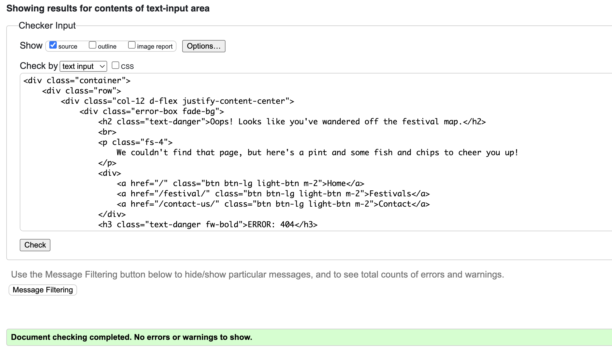

# Testing

> Return back to the [README.md](README.md) file.

## Code Validation

### HTML

I have used the recommended [HTML W3C Validator](https://validator.w3.org) to validate all of my HTML files.

| Directory | File | Screenshot | Notes |
| --- | --- | --- | --- |
| event | add_festival.html |  | Passed with no errors |
| event | edit_festival.html |  | Passed with no errors |
| event | festival_detail.html |  | Passed with no errors |
| event | festival_list.html |  | Passed with no errors |
| event | festival_search.html |  | Passed with no errors |
| event | index.html |  | Passed with no errors |
| event | user_profile.html |  | Passed with no errors |
| information | about.html |  | Passed with no errors |
| information | contact_us.html |  | Passed with no errors |
| account | login.html |  | Passed with no errors |
| account | signup.html |  | Passed with no errors |
| account | logout.html |  | Passed with no errors |
| account | password_change.html |  | Note due to allauth rendering a trailing forward slash |
| | |  | Searched for issue noted on page source but it says the line causing the issue doesn't exist |
| templates | 404.html |  | Passed with no errors, done by text input due to it not being able to check it through direct input with it being an error page |
| templates | 500.html |  | Passed with no errors, done by text input due to it not being able to check it through direct input with it being an error page |

