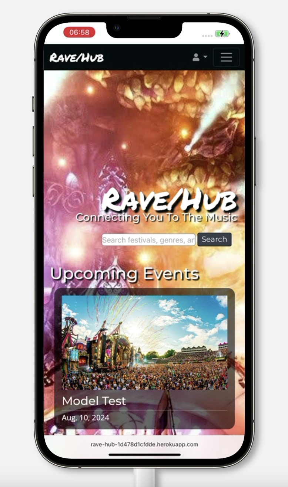
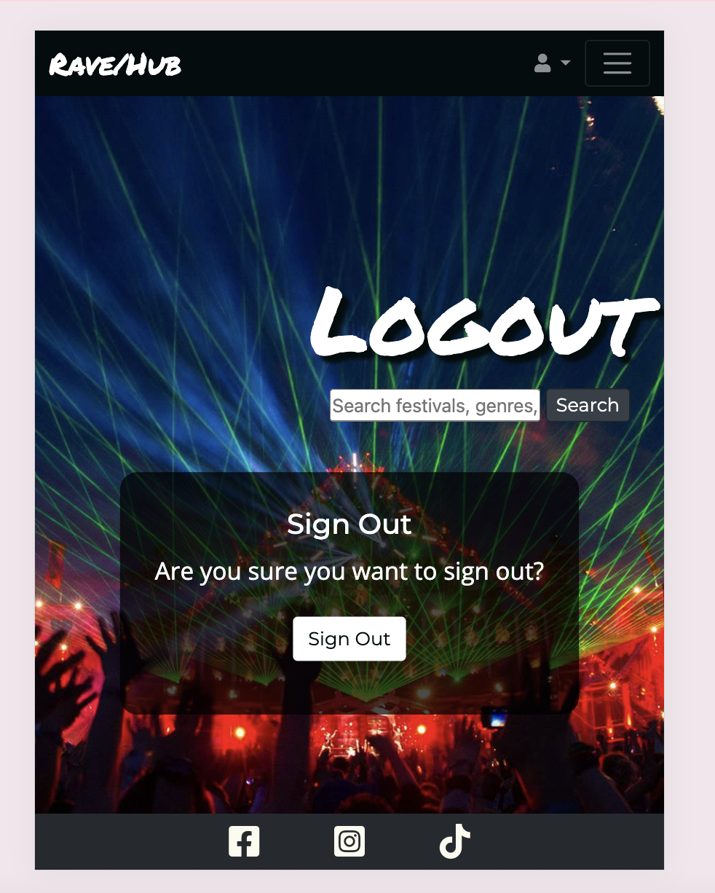
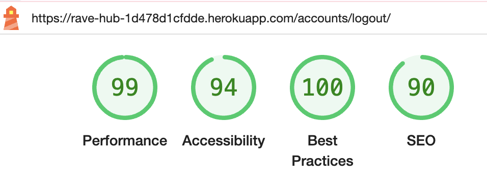
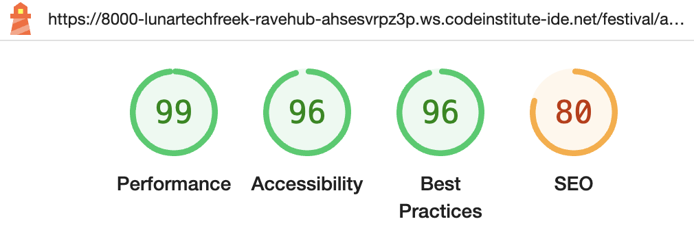

# Testing

> Return back to the [README.md](README.md) file.

## Code Validation

### HTML

I have used the recommended [HTML W3C Validator](https://validator.w3.org) to validate all of my HTML files.

| Directory | File | Screenshot | Notes |
| --- | --- | --- | --- |
| event | add_festival.html |  | Passed with no errors |
| event | edit_festival.html |  | Passed with no errors |
| event | festival_detail.html |  | Passed with no errors |
| event | festival_list.html |  | Passed with no errors |
| event | festival_search.html |  | Passed with no errors |
| event | index.html |  | Passed with no errors |
| event | user_profile.html |  | Passed with no errors |
| information | about.html |  | Passed with no errors |
| information | contact_us.html |  | Passed with no errors |
| account | login.html |  | Passed with no errors |
| account | signup.html |  | Passed with no errors |
| account | logout.html |  | Passed with no errors |
| account | password_change.html |  | Note due to allauth rendering a trailing forward slash |
| | |  | Searched for issue noted on page source but it says the line causing the issue doesn't exist |
| templates | 404.html |  | Passed with no errors, done by text input due to it not being able to check it through direct input with it being an error page |
| templates | 500.html |  | Passed with no errors, done by text input due to it not being able to check it through direct input with it being an error page |

### CSS

I have used the recommended [CSS Jigsaw Validator](https://jigsaw.w3.org/css-validator) to validate all of my CSS files.

| Directory | File | Screenshot | Notes |
| --- | --- | --- | --- |
| static | style.css |  | Passed with no errors |

### Python

I have used the recommended [PEP8 CI Python Linter](https://pep8ci.herokuapp.com) to validate all of my Python files.

| Directory | File | CI URL | Screenshot | Notes |
| --- | --- | --- | --- | --- |
| event | admin.py | [PEP8 CI](https://pep8ci.herokuapp.com/https://raw.githubusercontent.com/lunartechfreek/rave-hub/main/event/admin.py) |  | Passed with no errors |
| event | forms.py | [PEP8 CI](https://pep8ci.herokuapp.com/https://raw.githubusercontent.com/lunartechfreek/rave-hub/main/event/forms.py) |  | Passed with no errors |
| event | models.py | [PEP8 CI](https://pep8ci.herokuapp.com/https://raw.githubusercontent.com/lunartechfreek/rave-hub/main/event/models.py) |  | Passed with no errors |
| event | urls.py | [PEP8 CI](https://pep8ci.herokuapp.com/https://raw.githubusercontent.com/lunartechfreek/rave-hub/main/event/urls.py) |  | Passed with no errors |
| event | views.py | [PEP8 CI](https://pep8ci.herokuapp.com/https://raw.githubusercontent.com/lunartechfreek/rave-hub/main/event/views.py) |  | Passed with no errors |
| information | admin.py | [PEP8 CI](https://pep8ci.herokuapp.com/https://raw.githubusercontent.com/lunartechfreek/rave-hub/main/information/admin.py) |  | Passed with no errors |
| information | forms.py | [PEP8 CI](https://pep8ci.herokuapp.com/https://raw.githubusercontent.com/lunartechfreek/rave-hub/main/information/forms.py) |  | Passed with no errors |
| information | models.py | [PEP8 CI](https://pep8ci.herokuapp.com/https://raw.githubusercontent.com/lunartechfreek/rave-hub/main/information/models.py) |  | Passed with no errors |
| information | urls.py | [PEP8 CI](https://pep8ci.herokuapp.com/https://raw.githubusercontent.com/lunartechfreek/rave-hub/main/information/urls.py) |  | Passed with no errors |
| information | views.py | [PEP8 CI](https://pep8ci.herokuapp.com/https://raw.githubusercontent.com/lunartechfreek/rave-hub/main/information/views.py) |  | Passed with no errors |
|  | manage.py | [PEP8 CI](https://pep8ci.herokuapp.com/https://raw.githubusercontent.com/lunartechfreek/rave-hub/main/manage.py) |  | Passed with no errors |
| ravehub | settings.py | [PEP8 CI](https://pep8ci.herokuapp.com/https://raw.githubusercontent.com/lunartechfreek/rave-hub/main/ravehub/settings.py) |  | Passed with no errors |
| ravehub | urls.py | [PEP8 CI](https://pep8ci.herokuapp.com/https://raw.githubusercontent.com/lunartechfreek/rave-hub/main/ravehub/urls.py) |  | Passed with no errors |
| ravehub | views.py | [PEP8 CI](https://pep8ci.herokuapp.com/https://raw.githubusercontent.com/lunartechfreek/rave-hub/main/ravehub/views.py) |  | Passed with no errors |

## Browser Compatibility

I've tested my deployed project on multiple browsers to check for compatibility issues.

### Browser Testing

| Browser | Home | Notes |
| --- | --- | --- |
| Chrome |  | Works as expected |
| Edge |  | Works as expected |
| Firefox |  | Works as expected |
| Opera |  | Works as expected |
| Safari |  | Works as expected |

### Device Browser Testing

| Device | Browser | Home | Notes |
| --- | --- | --- | --- |
| Iphone 15 ProMax | Safari |  | Works as expected - Manual test |
| Iphone 13 ProMax | Safari |  | Works as expected |
| Iphone 12 Pro | Chrome |  | Works as expected |
| Samsung Galaxy S22 Ultra | Chrome |  | Works as expected - Manual test |
| Google Pixel 8 Pro | Edge |  | Works as expected |
| Google Pixel 7 | Chrome |  | Works as expected |
| Huawei P30 | Chrome |  | Works as expected |
| Samsung Tab S7 | Firefox |  | Works as expected |
| Ipad 10th Gen | Safari |  | Works as expected |

## Responsiveness

I've tested my deployed project on multiple devices to check for responsiveness issues.

| Device | Home | Notes | Test |
| --- | --- | --- | --- |
| Iphone 15 ProMax |  | Works as expected | Manual test |
| Iphone 13 ProMax |  | Works as expected | Browserstack test |
| Iphone 12 Pro |  | Works as expected | Browserstack test |
| Iphone SE |  | Works as expected | Chrome DevTools test |
| Iphone XR |  | Works as expected | Chrome DevTools test |
| Samsung Galaxy S22 Ultra |  | Works as expected | Manual test |
| Google Pixel 8 Pro |  | Works as expected | Browserstack test |
| Google Pixel 7 |  | Works as expected | Browserstack test |
| Samsung Galaxy Z Fold 5 |  | Works as expected | Chrome DevTools test |
| Samsung Galaxy S8+ |  | Works as expected | Chrome DevTools test |
| Samsung Galaxy S20 Ultra |  | Works as expected | Chrome DevTools test |
| Samsung Galaxy A51/71 |  | Works as expected | Chrome DevTools test |
| Huawei P30 |  | Works as expected | Browserstack test |
| Samsung Tab S7 | Firefox |  | Works as expected |
| Ipad 10th Gen |  | Works as expected | Browserstack test |
| Ipad Air |  | Works as expected | Chrome DevTools test |
| Ipad Mini |  | Works as expected | Chrome DevTools test |
| Microsoft Surface Duo |  | Works as expected | Chrome DevTools test |
| Microsoft Surface Pro 7 |  | Works as expected | Chrome DevTools test |

## Lighthouse Audit

I've tested my deployed project using the Lighthouse Audit tool to check for any major issues.

| Page | Mobile | Desktop | Notes |
| --- | --- | --- | --- |
| Index |  |  |  |
| Add Festival |  |  |  |
| Edit Festival |  |  | I think that the error is being caused by the fact that this is the only page that renders the background as the image that the user has uploaded. I have manually checked the contrast of the text items as is shown below and the accessibility is passing. This is something that will be listed as a future devolpment to look further into   |
| Festival Detail |  |  |  |
| Festival List |  |  |  |
| Festival Search |  |  |  |
| User Profile |  |  |  |
| About |  |  |  |
| Contact |  |  |  |
| Login |  |  |  |
| Sign Up |  |  |  |
| Logout |  |  |  |
| Password Change |  |  |  |
| 404 |  |  |  |
| 505 |  |  |  |

